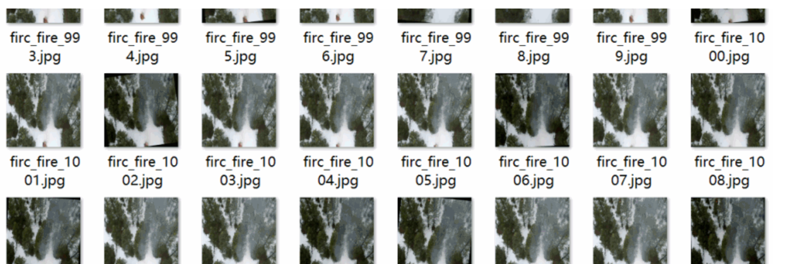

# Vertical Drone and Airborne Forest Fire Detection Dataset: VOC+YOLO Format with 6116 Images in 2 Categories.rar

310.73MB rar
The dataset format includes both Pascal VOC and YOLO formats (excluding txt files containing split paths, only including jpg images along with their corresponding VOC xml files and YOLO txt files).

Number of images (jpg file count): 6116
Number of annotations (xml file count): 6116
Number of annotations (txt file count): 6116
Number of annotated categories: 2
Annotation category names: ["fire", "smoke"]
Number of boxes for each category:
- fire boxes = 15380
- smoke boxes = 12613
Total boxes = 27993
Annotation tools used: labelImg
Annotation rules: draw rectangle boxes for categories
Important note: No special statement is made regarding the precision of the trained model or weight files. The dataset provides accurate and reasonable annotations only.

## Images

Here is a pay link on Stripe ( https://buy.stripe.com/3cs8yP7sY87d0vu9AB ). Please contact me lonlonago@foxmail.com after funding $89, and I will send you a complete data files , thank you!

